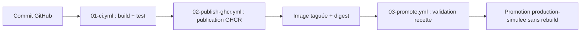

# 02 - Schéma de la chaîne CICD

## Schéma logique

## Explication

1. **Commit GitHub** : toute modification (site, Dockerfile, workflow, documentation) est versionnée dans le dépôt. L'historique des commits constitue la première brique de traçabilité.
2. **01-ci.yml — build + test** : à chaque push, le workflow vérifie la présence des fichiers attendus, valide la syntaxe du `compose.yml`, construit l'image Docker, démarre le conteneur, puis exécute un test HTTP réel (page d'accueil et `version.json`) et un test de contenu. Si une étape échoue, la chaîne s'arrête : aucune image défectueuse ne peut avancer.
3. **02-publish-ghcr.yml — publication** : sur la branche principale, l'image validée est reconstruite dans un environnement propre puis poussée dans GitHub Container Registry avec ses tags (`sha-<commit>`, `latest`) et son **digest** (`sha256:...`), qui identifie l'artefact de manière unique et immuable.
4. **Image taguée + digest** : le tag est un nom lisible et déplaçable ; le digest est l'empreinte cryptographique du contenu. C'est le digest qui garantit que l'on parle toujours exactement du même artefact.
5. **03-promote.yml — validation recette** : déclenché manuellement (`workflow_dispatch`), le workflow télécharge l'image **déjà publiée** (aucun rebuild), la démarre dans l'environnement GitHub `recette` et rejoue le test HTTP. Le digest observé est affiché dans le résumé du run : c'est la preuve de l'artefact validé.
6. **Promotion production-simulee sans rebuild** : après la recette (et l'approbation manuelle configurée sur l'environnement), le **même artefact** reçoit le tag `production-simulee` et est repoussé vers GHCR. Aucune commande `docker build` n'apparaît dans ce workflow : c'est le principe « build once, promote many ».

## Orchestration légère

Le fichier `compose.yml` décrit un service `web` (le site Nginx construit à partir du Dockerfile) et un second service `tester` (image `curlimages/curl`) qui attend le démarrage du web puis vérifie par HTTP la page d'accueil et `version.json`. Les deux services communiquent par un réseau dédié `cicd_net` : Compose coordonne ainsi le cycle de vie et la mise en réseau de plusieurs conteneurs à partir d'un seul fichier déclaratif.

Le service `web` n'expose pas de port fixe sur la machine hôte (`expose` et non `ports`) : ce choix permet la simulation de mise à l'échelle `docker compose up -d --scale web=2` sans conflit de ports (voir docs/03-fiche-tests.md).

## Limite importante

Docker Compose est utile pour une mise en situation, un test local ou une démonstration de coordination. En production réelle, il faudrait traiter d'autres sujets : haute disponibilité, répartition de charge, supervision, politique de déploiement, rollback, sécurité, sauvegarde et restauration.

Concrètement, Docker Compose ne fournit pas :
- de **répartiteur de charge** intégré entre les réplicas d'un service ;
- de **redémarrage sur un autre hôte** en cas de panne de la machine (mono-hôte par nature) ;
- de **déploiement progressif** (rolling update, canary) ni de retour arrière automatique ;
- de **supervision** ni d'auto-scaling en fonction de la charge.

Un orchestrateur comme **Kubernetes** apporte ces fonctions (Deployments, Services, probes, HPA, rollout/rollback), au prix d'une complexité bien supérieure, injustifiée pour ce périmètre pédagogique. Le lien avec la robustesse de la chaîne CI/CD reste le même dans les deux mondes : on ne déploie que des **artefacts identifiés** (tag + digest), reproductibles et traçables.
