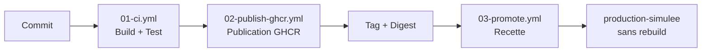

# Projet CICD — EC06 (Catal-Log)

Chaîne CI/CD complète pour construire, tester, publier et promouvoir une image Docker Nginx servant un site statique, via GitHub Actions et GitHub Container Registry (GHCR).

- **Auteur** : Anonymous
- **Formation** : ASRC — RNCP39611 · Bloc RNCP39611BC02 · Évaluation EC06

## Chaîne CI/CD



| Workflow | Déclenchement | Rôle |
|---|---|---|
| `01-ci.yml` | À chaque push / PR | Vérifications, build Docker, test HTTP automatisé |
| `02-publish-ghcr.yml` | Push sur `main` | Publication GHCR avec tag `sha-*`, `latest` et digest |
| `03-promote.yml` | Manuel (`workflow_dispatch`) | Validation en `recette` puis promotion `production-simulee` **sans rebuild** |

## Structure du dépôt

```
├── site/                  # Site statique (index.html + version.json)
├── Dockerfile             # Image Nginx reproductible
├── compose.yml            # Orchestration légère (web + tester)
├── .github/workflows/     # Les 3 workflows CI/CD
└── docs/                  # Cadrage, schéma, tests, preuves, sécurité, compte rendu
```

## Documentation

| Fichier | Contenu |
|---|---|
| [docs/01-cadrage-projet.md](docs/01-cadrage-projet.md) | Cadrage, contraintes, choix personnels |
| [docs/02-schema-chaine-cicd.md](docs/02-schema-chaine-cicd.md) | Schéma et explication de la chaîne, orchestration légère |
| [docs/03-fiche-tests.md](docs/03-fiche-tests.md) | Tests CI, tests locaux, simulation de scaling et limites |
| [docs/04-preuve-image.md](docs/04-preuve-image.md) | Image GHCR, tag, digest |
| [docs/05-preuve-recette.md](docs/05-preuve-recette.md) | Validation recette simulée |
| [docs/06-preuve-promotion.md](docs/06-preuve-promotion.md) | Promotion sans rebuild (preuve par digest) |
| [docs/07-securite-minimale.md](docs/07-securite-minimale.md) | Permissions, secrets, rollback, sauvegarde/restauration |
| [docs/08-compte-rendu-final.md](docs/08-compte-rendu-final.md) | Compte rendu final personnel |

## Tester en local

```bash
docker compose up --build     # démarre web + le testeur HTTP
docker compose up -d --scale web=2 && docker compose ps   # simulation de scaling
```
